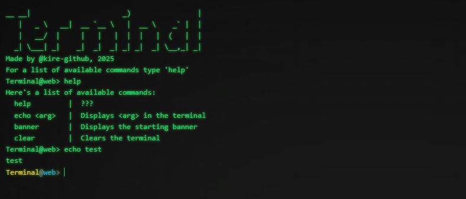

\
Technologies: React, Vite, Tailwindcss

Run the project locally with:
```
npm run build
npm run preview
```
or with dev tools enabled:
```
npm run dev
```

## Project goals
- [x] Build a terminal-like web application
- [x] Using React
- [x] Style it with Tailwindcss

## Main takeaways
**React:**\
The biggest obstacles when writing this project stemmed from React's asynchronous style, however most of the problems could be solved with proper useage of the built-in hooks. As a beginner it took some time to get used to which hook to use when, most confusion came from when exactly does a rerender happen, and what gets rerendered, but these have been cleared up decently. It was important to discover how React uses the keys of different elements to reduce the number of elements rerendered.

**Tailwindcss:**\
Tailwind is powerful because it simplifies the css writing process, however the styling does get moved to the code, making it a bit harder to read, and there do exist certain things that are not achievable with just Tailwind alone.

**Vite:**\
Although not touched in depth, Vite made project creation and building quick and easy.